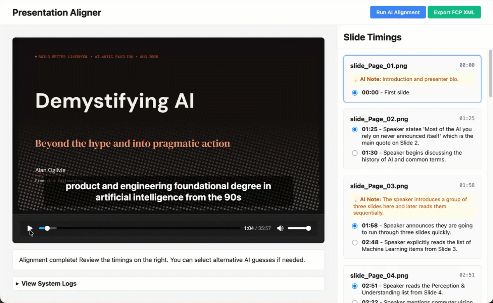
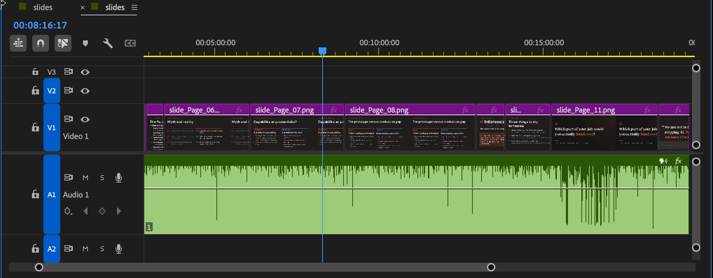

# Presentation Slide & Audio Aligner

*A local AI pipeline that eliminates hours of manual video editing by autonomously syncing presentation slides to live audio recordings.*



## Commercial Use Cases
This tool transforms how organizations process and publish presentation content at scale:
- **B2B Event Marketing:** Rapidly publish keynote stage talks and panel discussions to social media without waiting for video editing teams.
- **Sales Enablement:** Instantly sync and distribute sales kick-off decks and training presentations.
- **Corporate Training:** Convert live recorded workshops into structured, on-demand video learning modules.

## The Origin Story & Problem Statement
I originally built this tool to solve a painful, real-world problem for myself: I had recorded the live audio of me giving a presentation to an audience, but I failed to capture the offset timings of when I transitioned to the next slide. I was faced with the tedious prospect of manually scrubbing through an hour of audio just to figure out exactly when I clicked "next" on my slide deck. 

Instead of doing it manually, I built this AI pipeline to autonomously figure out the slide timings based on what I was actually saying, allowing me to quickly output a polished video for YouTube and LinkedIn that perfectly synced my real, live voiceover with the high-quality slide images.

## The Full Agentic Workflow (From Stage to LinkedIn)
Here is the complete workflow I used to achieve the final result:
1. **Audio Enhancement:** The raw audio recording from the event was first run through an AI audio enhancer to clear up the voice recording.
2. **Transcription:** The enhanced audio was fed into MacWhisper to generate a highly accurate WebVTT (`.vtt`) transcript with speaker detection.
3. **Agentic AI Alignment (This Tool):** Rather than a simple script, we built an agentic workflow using the **Google Gemini 3.5 Flash** API. Acting as a reasoning agent, Gemini performs multimodal context matching—taking disparate inputs (text transcripts and PDF speaker notes) and making contextual decisions on exact timing transitions. 
4. **Visual Review:** Using the web interface, we reviewed the agent's timing choices, listening to the audio and watching the slides automatically update in real-time.
5. **Premiere Pro Assembly:** The tool exported a Final Cut Pro XML (FCP XML) file containing frame-accurate cuts. This was imported directly into Adobe Premiere Pro, instantly assembling the final video timeline.



## Features
- **Agentic Audio Alignment**: Uses Gemini 3.5 Flash as a reasoning engine to map WebVTT transcripts and PDF slides (including speaker notes).
- **Interactive Web UI**: Review the agent's contextual guesses, see alternative timing options with reasoning, and watch a live preview of the slides perfectly synced with the audio player and custom subtitle overlay.
- **Premiere Pro Export**: Automatically updates a template FCP XML file with frame-accurate timings (25 FPS default) and absolute file paths, allowing you to import a fully cut sequence directly into Premiere Pro with zero manual syncing.
- **Smart Caching & Fault Tolerance**: API responses are cached locally to save time and API tokens during reloads, with fallback mechanisms to handle LLM hallucinations.

## Agentic Guardrails & Prompt Design
To ensure the Gemini 3.5 Flash API behaves consistently as a deterministic agent rather than a creative chatbot, we implemented strict system prompts and programmatic guardrails:
- **Role & Constraints:** The model is explicitly cast as an "expert video editor" and given rigid, ordered constraints (e.g., *"Assume the presenter never physically moves back to a previous slide on the screen."*).
- **Audience Noise Filtering:** The prompt instructs the agent to analyze the VTT speaker tags to actively ignore Q&A chatter (`<v Other>`) and isolate the primary speaker (`<v Alan Ogilvie>`).
- **Structured JSON Output:** The model is forced to return a strict JSON schema containing arrays of timing options (with explicit reasoning for each). We run it at a low temperature (`0.2`) to minimize hallucination.
- **Programmatic Fallbacks:** In Python, the output is strictly validated before passing to the UI. If the agent hallucinates and drops a required key (like a timing alternative), the engine automatically injects a safe fallback value so the web app never crashes.

## Future Enhancements
- **Synthetic Avatar Fallback:** If the original audio or stage lighting is poor, automatically generate a synthetic AI avatar to seamlessly deliver the speaker notes instead.
- **Adobe Premiere Pro MCP Server:** If an MCP (Model Context Protocol) server existed for Adobe Premiere Pro, we could entirely automate the final step—allowing the AI agent to launch Premiere, ingest the FCP XML, and populate the project timeline without any manual human clicks.
- **Audio Trimming:** Add a feature to automatically detect absolute silence at the end of the audio file and trim the final slide's duration accordingly.
- **Cloud Transcription Integration:** While I deliberately used a local instance of MacWhisper for transcription (providing greater control and leveraging a local model attuned to my specific speech quirks), this pipeline could easily integrate cloud-based transcription APIs (like AssemblyAI or Google Cloud Speech-to-Text) for a fully remote workflow.

## Required Inputs & Formats
To use the tool, you must collate the following specific files and place them into their respective directories:

- `audio-recording/`
  - **Format:** `.aac`, `.wav`, `.m4a`, or `.mp3`
  - **Details:** Your primary audio recording of the presentation.
- `transcript/`
  - **Format:** WebVTT (`.vtt`)
  - **Details:** The transcript of your audio. We used MacWhisper to generate this. The AI can use speaker tags (like `<v Alan>`) to ignore audience chatter or Q&A sessions.
- `presentation-slides-pdf-with-notes/`
  - **Format:** `.pdf`
  - **Details:** An export of your presentation deck. It is highly recommended that this PDF includes your speaker notes, as the AI uses them to contextually match what you are saying to the correct slide.
- `presentation-slides-png/`
  - **Format:** `.png`
  - **Details:** Export your slides as individual image files. Ensure they are sequentially named (e.g., `slide_Page_01.png`, `slide_Page_02.png`). These are used for the web preview and are linked directly into Premiere Pro.
- `edl-in/`
  - **Format:** Final Cut Pro XML (`.xml`)
  - **Details:** Create a basic sequence in Premiere Pro containing your slides in order, and export it as an FCP XML (e.g., `slides.xml`). Our tool uses this exact file as a master template to preserve media links and sequence settings (like your framerate).
- `edl-out/`
  - **Format:** Final Cut Pro XML (`.xml`)
  - **Details:** Empty directory. The final, time-aligned `aligned_sequence.xml` will be saved here when you click Export.

## Setup Instructions

1. **Clone the repository:**
   ```bash
   git clone https://github.com/webziggy/slides-to-video-with-recordedvoiceover.git
   cd slides-to-video-with-recordedvoiceover
   ```

2. **Set up a Python Virtual Environment:**
   ```bash
   python3 -m venv venv
   source venv/bin/activate
   ```

3. **Install Dependencies:**
   ```bash
   pip install -r requirements.txt
   ```

4. **Configure API Key:**
   Copy the example environment file and add your Google Gemini API key.
   ```bash
   cp .env.example .env
   # Open .env and add your GEMINI_API_KEY
   ```

## Usage

1. Start the Flask server:
   ```bash
   python3 app.py
   ```
2. Open your web browser and navigate to `http://127.0.0.1:5000`
3. Click **Run AI Alignment**.
4. Review the timeline on the right. If the AI's primary guess is slightly off, click one of the alternative radio buttons to instantly update the timeline.
5. Click **Export FCP XML**.
6. Open Adobe Premiere Pro and go to `File > Import`. Select the `edl-out/aligned_sequence.xml` file. Your perfectly synced sequence will appear in your project bin!

---

> <sub>**About This Project: AI-Assisted Product Development & "Vibe Coding"**</sub>
> 
> <sub>*This repository serves as a practical demonstration of modern AI-assisted product development, showcasing my approach to human-AI collaboration (a concept I explore further in my article, [Beyond the Prompt](https://www.linkedin.com/pulse/beyond-prompt-alan-ogilvie-iqqte/)).*</sub>
> 
> <sub>*While the core code in this repository was generated in collaboration with **Google's Antigravity AI agent**, the product vision, architecture, and execution were entirely driven by human direction. Acting as the Product Lead, I defined the Product Requirements, established the workflow goals, and orchestrated the AI's tasks.*</sub>
> 
> <sub>*Furthermore, wearing an engineering hat, I didn't just accept the AI's initial outputs. I actively engaged in architectural decision-making (such as pivoting from a legacy EDL to a robust FCP XML structure), rigorous debugging, and UI/UX improvements. This project highlights how AI can accelerate development when guided by strong product strategy and deep technical oversight.*</sub>
